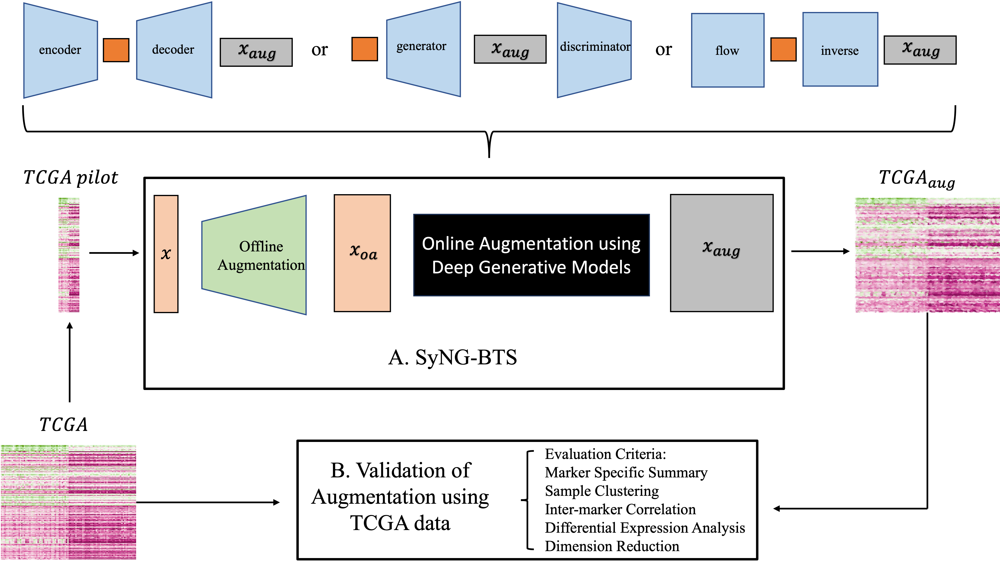

# SyNG-BTS: Synthesis of Next Generation Bulk Transcriptomic Sequencing,

## What is it

SyNG-BTS is a data augmentation tool synthesizing transcriptomics data with realistic distributions without relying on a predefined formula. Three deep generative models are considered, incluing Variational Auto Encoder (VAE), Generative Adversarial Network (GAN), and flow-based generative model. Those models will be trained on a pilot dataset and then utilized to generate data for any desired number of samples. The workflow of SyNG-BTS is depicted in the following figure:

<p align="center">
  
</p>

## News 
* Jan, 2024: SyNG-BTS version 1.0.0 is launched.

## System Requirements
### Hardware requirements
`SyNG-BTS` requires only a standard computer with enough RAM to support the in-memory operations. 

### Software requirements
#### OS Requirements
The developmental version of the package has been tested on the following systems:
+ Windows
+ MacOS
 
  
#### Python Dependencies
`SyNG-BTS` depends on the following Python packages:

    torch 1.3.1
    pandas 1.0.5
    seaborn 0.9.0
    numpy 1.19.1
    pathlib2 2.3.2
    re 2.2.1
    scipy 1.4.1
    matplotlib 2.2.3
    tqdm 4.26.0
    tensorboardX 2.5.0
    os
    random
    time
    copy
    math

## Quick start in python
```python
from Experiments_new import *

# run pilot experiments
PilotExperiment(dataname = "SKCMPositive_4", pilot_size = [100],
                model = "VAE1-10", batch_frac = 0.1, 
                learning_rate = 0.0005, pre_model = None,
                epoch = None,  off_aug = None, early_stop_num = 30,
                AE_head_num = 2, Gaussian_head_num = 9)

# running application on case study BRCASubtype
ApplyExperiment(path = "../Case/BRCASubtype/", dataname = "BRCASubtypeSel", apply_log = True, 
                new_size = [1000], model = "WGANGP" , batch_frac = 0.1, 
                learning_rate = 0.0005, epoch = 10, early_stop_num = 30, 
                off_aug = None, AE_head_num = 2, Gaussian_head_num = 9, 
                pre_model = None, save_model = None)

# Running transfer learning
Transfer(pilot_size = None, fromname = "PRAD", toname = "BRCA", fromsize = 551, 
         new_size = 500, apply_log = True, model = "maf", epoch = 10,
         batch_frac = 0.1, learning_rate = 0.0005, off_aug = None)
```

## Examples & Tutorials
Using three examples of pilot experiment for VAE with loss ratio 1-10 on dataset SKCMPositive_4, case study for WGAN-GP on dataset BRCASubtype and transfer learning for MAF from PRAD dataset to BRCA,  we demonstrate how to execute 'SyNG-BTS'. <br>

If you also would like to use PENCIL in python, continue here:
+ [SyNG Tutorial in Python](https://github.com/LXQin/SyNG-BTS/blob/main/SyNG-BTS/Python/Experiments_run.ipynb)


## How to Cite SyNG-BTS
Please cite the following manuscript:
>Supervised learning of high-confidence phenotypic subpopulations from single-cell data. Nature Machine Intelligence (2023). https://doi.org/10.1038/s42256-023-00656-y. <br>
Tao Ren, Canping Chen, Alexey V. Danilov, Susan Liu, Xiangnan Guan, Shunyi Du, Xiwei Wu, Mara H. Sherman, Paul T. Spellman, Lisa M. Coussens, Andrew C. Adey, Gordon B. Mills, Ling-Yun Wu and Zheng Xia


## License
PENCIL is licensed under the GNU General Public License v3.0. <br>
PENCIL will be updated frequently with new features and improvements. If you have any questions, please submit them on the [GitHub issues page](https://github.com/cliffren/PENCIL/issues) or check the [FAQ](https://cliffren.github.io/PENCIL/examples/FAQ/PENCIL_FAQ.html) list.

